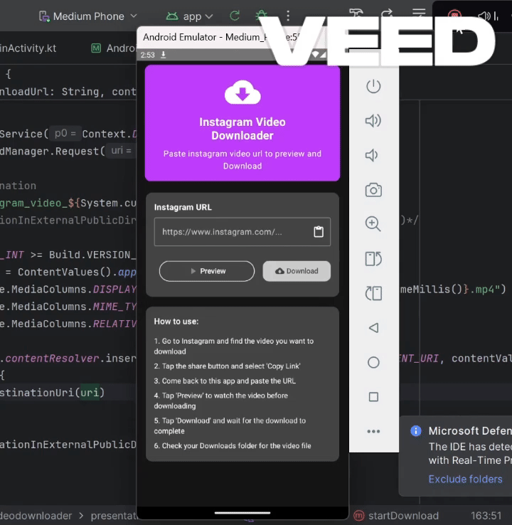

# 📥 Instagram Video Downloader

An Android app to download Instagram videos, reels, and IGTV with a simple and modern UI.

## 🎥 Demo

## ✨ Features
- 🎥 Video Preview before downloading  
- 📱 Material Design 3 UI  
- 📋 Clipboard Integration for Instagram URLs  
- ⬇️ Background Downloads using DownloadManager  
- 🔗 Supports posts, reels, and IGTV  
- 📁 Saved in Downloads folder  
- 🎬 Built-in Video Player with ExoPlayer  

## 🛠️ Built With
- Jetpack Compose  
- Material Design 3  
- ExoPlayer  
- Kotlin Coroutines  
- ViewModel & StateFlow (MVVM)  
- DownloadManager  

---
